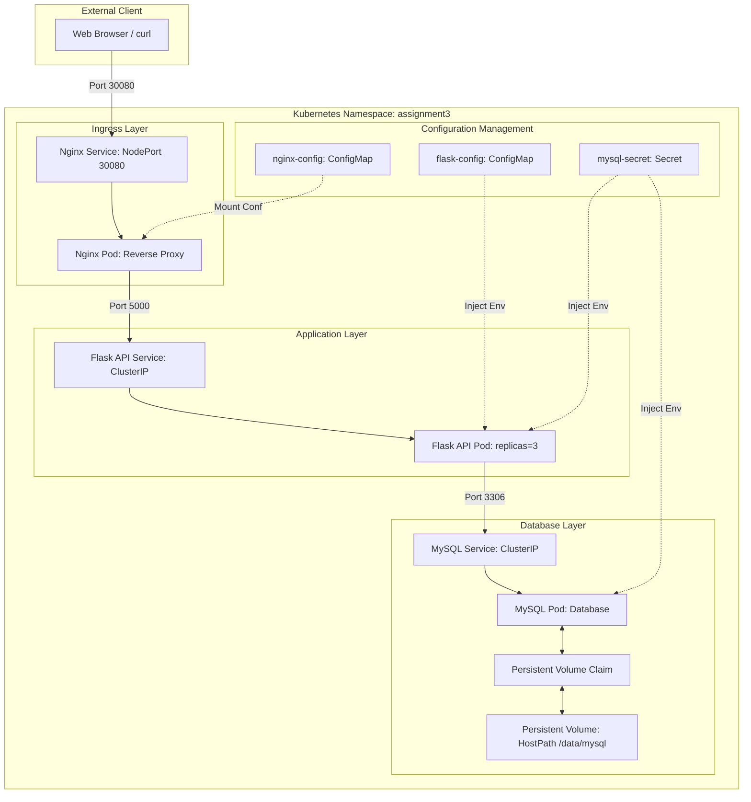

# Assignment 3 Technical Report: Kubernetes Orchestration & Full DevOps Pipeline

**Course:** DevOps and Cloud Computing
**Student Name:** Saim Ali  
**Roll Number:** F2022-002  

---

## 1. System Architecture & Diagram

This project implements a classic 3-tier microservice architecture containerized with Docker, automated using GitHub Actions, and orchestrated using Kubernetes on Minikube.



### Components:
1. **Nginx Reverse Proxy:** Serves as the external entry point (NodePort 30080). Routes incoming requests to the internal Flask API. Configured via Nginx ConfigMap.
2. **Flask API:** Python backend implementing CRUD endpoints `/api/items` and `/health`. It communicates with the database and scales to multiple replicas.
3. **MySQL Database:** Relational database configured with persistent storage via PersistentVolume and Secret credentials. Exposed only internally (ClusterIP).

---

## 2. Part A: Git & Version Control

We configured Git with our identity, created a comprehensive `.gitignore` to keep credentials and IDE noise out of the repo, and implemented a proper branching strategy.

### Branches Created:
* `main`: Stable release branch.
* `develop`: Integration branch.
* `feature/docker-setup`: Specifically used for docker containerization.
* `feature/k8s-deployment`: Used for creating Kubernetes manifests.

### Branch List & Git Log

```bash
# Verify branches
git branch -a
```
> **[Insert Screenshot: Branch List output]**

```bash
# Check git history
git log --oneline --graph --all
```
> **[Insert Screenshot: Git Log showing 10+ commits and merge history]**

---

## 3. Part B: Containerization with Docker

We containerized the Flask application and Nginx reverse proxy using Docker, defined networking, and verified local persistence using volumes.

### Dockerfiles Overview

1. **Flask API Dockerfile (`app/flask-api/Dockerfile`):**
   * Uses `python:3.11-slim` to minimize image size.
   * Copies `requirements.txt` and runs `pip install` before copying code to optimize Docker layer caching.
   * Exposes port `5000` and starts Flask using `python app.py`.

2. **Nginx Dockerfile (`app/nginx/Dockerfile`):**
   * Uses `nginx:alpine` for a lightweight and secure proxy base.
   * Deletes the default configuration.
   * Copies the custom `nginx.conf` containing routing directives to `flask-api:5000`.

### Docker Compose

We configured `docker-compose.yml` to orchestrate all three services locally on a custom bridge network (`app-network`). It includes a MySQL healthcheck so the Flask API container only boots up once the database is fully ready.

```bash
# Start Docker Compose
cd app && docker compose up -d
```
> **[Insert Screenshot: docker compose up starting the containers]**

```bash
# Verify running containers
docker ps
```
> **[Insert Screenshot: Running docker containers list]**

```bash
# Check network and volumes
docker network ls
docker volume ls
```
> **[Insert Screenshot: Docker networks and volumes list]**

### Persistence & Endpoint Verification

We verified the API endpoints and validated that database records survive container restarts (persistence test):

```bash
# 1. Health check endpoint
curl http://localhost/health

# 2. Add an item
curl -X POST http://localhost/api/items \
  -H "Content-Type: application/json" \
  -d '{"name": "Docker Item", "description": "This survives compose restarts"}'

# 3. Stop containers without deleting volumes
docker compose down

# 4. Restart containers
docker compose up -d

# 5. Verify item still exists
curl http://localhost/api/items
```
> **[Insert Screenshot: curl commands showing healthy status, item creation, and verification after restarting compose]**

---

## 4. Part C: CI/CD with GitHub Actions

We automated the build and push steps using GitHub Actions.

### Pipeline Config (`.github/workflows/ci-cd.yml`)
The workflow triggers on any push or pull request to the `main` branch. It:
1. Checks out the code.
2. Logs in to DockerHub using GitHub Secrets (`DOCKERHUB_USERNAME` and `DOCKERHUB_TOKEN`).
3. Builds and pushes the Flask API and Nginx images to DockerHub with the `:latest` tag.

> **[Insert Screenshot: Successful GitHub Actions workflow execution with a green checkmark]**

> **[Insert Screenshot: DockerHub Repositories showing uploaded images]**

---

## 5. Part D: Kubernetes Orchestration on Minikube

We created declarative manifest files for all components in the `k8s/` directory.

### YAML Explanations

| Manifest | Type | Purpose / Description |
|---|---|---|
| `namespace.yml` | `Namespace` | Creates an isolated logical cluster named `assignment3` to partition resources. |
| `mysql-secret.yml` | `Secret` | Stores sensitive DB environment variables in Base64 encoding. Used by Flask and MySQL. |
| `mysql-pv.yml` | `PersistentVolume` | Allocates `1Gi` physical storage mapped to `/data/mysql` on the node with `manual` storage class. |
| `mysql-pvc.yml` | `PersistentVolumeClaim` | Requests `1Gi` storage. Binds directly to `mysql-pv` using `manual` storage class. |
| `mysql-deployment.yml` | `Deployment` | Runs `mysql:8.0` with `1` replica, mounts the PVC at `/var/lib/mysql`, and injects credentials from the Secret. |
| `mysql-service.yml` | `Service` (ClusterIP) | Creates a stable internal IP address `mysql` for DB traffic. Never exposed outside. |
| `flask-configmap.yml` | `ConfigMap` | Stores non-sensitive configs like DB hostname (`mysql`), DB name (`flaskdb`), and environment. |
| `flask-deployment.yml` | `Deployment` | Runs Flask application using the DockerHub image. Maps variables from ConfigMap/Secret. Implements liveness and readiness probes to manage self-healing. |
| `flask-service.yml` | `Service` (ClusterIP) | Exposes Flask API internally on port 5000 so Nginx can proxy to it. |
| `nginx-configmap.yml` | `ConfigMap` | Overrides default Nginx config to proxy traffic to Kubernetes service DNS name (`flask-api:5000`). |
| `nginx-deployment.yml` | `Deployment` | Runs Nginx using the DockerHub image and mounts the configuration file from Nginx ConfigMap. |
| `nginx-service.yml` | `Service` (NodePort) | Exposes Nginx externally on port `30080` of the host VM for client access. |

### Comparison of Service Types
1. **ClusterIP (Default):** Exposes the service on a cluster-internal IP. Good for secure, backend-to-backend communication (like MySQL and Flask API) where external access is blocked.
2. **NodePort:** Exposes the service on each node’s IP at a static port (in the range 30000-32767). Allows direct external access (like Nginx on 30080).
3. **LoadBalancer:** Uses a cloud provider's external load balancer to route traffic. Not natively supported in basic local bare-metal clusters without extra tools (like MetalLB) but standard in cloud environments (AWS, GCP, Azure).

### Manifest Status in Cluster

```bash
# Get all resources in namespace
kubectl get all -n assignment3
```
> **[Insert Screenshot: Running Pods, Deployments, and Services in namespace assignment3]**

```bash
# Verify PV and PVC binding
kubectl get pv
kubectl get pvc -n assignment3
```
> **[Insert Screenshot: PV and PVC showing status BOUND]**

```bash
# Verify secrets and configmaps
kubectl get secrets,configmaps -n assignment3
```
> **[Insert Screenshot: Secrets and ConfigMaps details]**

---

## 6. Verification & Self-Healing

We ran verification checks using `start.sh` and manual testing.

### End-to-End Functionality

Using NodePort, we successfully verified CRUD operations:

```bash
# Verify health check
curl http://$(minikube ip):30080/health

# Create an item
curl -X POST http://$(minikube ip):30080/api/items \
  -H "Content-Type: application/json" \
  -d '{"name": "Kubernetes Item", "description": "Created on K8s"}'

# List items
curl http://$(minikube ip):30080/api/items
```
> **[Insert Screenshot: API Curl responses on Kubernetes NodePort]**

### Self-Healing Test
We tested self-healing by deleting a Flask pod. The deployment controller detected the failure and recreated the pod immediately.

```bash
# Delete Flask Pod
kubectl delete pod -l app=flask-api -n assignment3

# View Pod state immediately
kubectl get pods -n assignment3
```
> **[Insert Screenshot: Pod deletion and the automatic startup of a new pod instance]**

### Data Persistence Test
We validated persistence by deleting the MySQL pod. The database volume preserved the database files, and existing items remained accessible after MySQL recreated.

```bash
# Delete MySQL Pod
kubectl delete pod -l app=mysql -n assignment3

# Wait for recreation and query Flask API again
curl http://$(minikube ip):30080/api/items
```
> **[Insert Screenshot: MySQL pod recreating and curl listing items indicating the data survived]**

---

## 7. Scaling, Updates & Rollbacks

We demonstrated the scalability and update mechanisms of Kubernetes.

### Scaling the API
We scaled the Flask API from 1 replica to 3.

```bash
# Scale up
kubectl scale deployment flask-api --replicas=3 -n assignment3

# Check pods
kubectl get pods -n assignment3 -l app=flask-api
```
> **[Insert Screenshot: Three flask-api pods running concurrently]**

### Rolling Updates
We updated the Flask image to simulate a v2 deployment.

```bash
# Set new image
kubectl set image deployment/flask-api flask-api=saimdevops/flask-api:v2 -n assignment3

# Watch status
kubectl rollout status deployment/flask-api -n assignment3
```
> **[Insert Screenshot: Rolling update progress showing old pods terminating and new pods launching]**

### Rollbacks
We rolled back the deployment to the previous working configuration.

```bash
# Check history
kubectl rollout history deployment/flask-api -n assignment3

# Undo rollout
kubectl rollout undo deployment/flask-api -n assignment3

# Verify image name has reverted
kubectl describe deployment flask-api -n assignment3 | grep Image
```
> **[Insert Screenshot: Rollout undo output showing restoration of the original image]**

---

## 8. Conclusion

All components are configured correctly. The application achieves full persistence, high availability through self-healing and replication, and can be easily maintained via automated pipelines and rolling updates.
